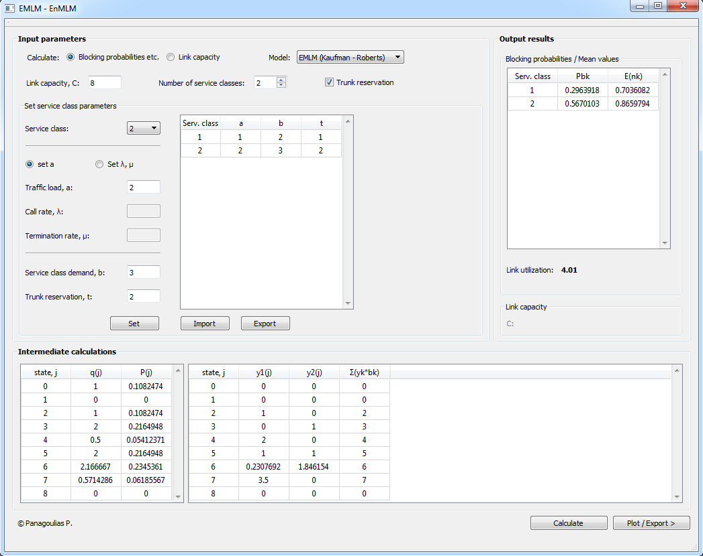
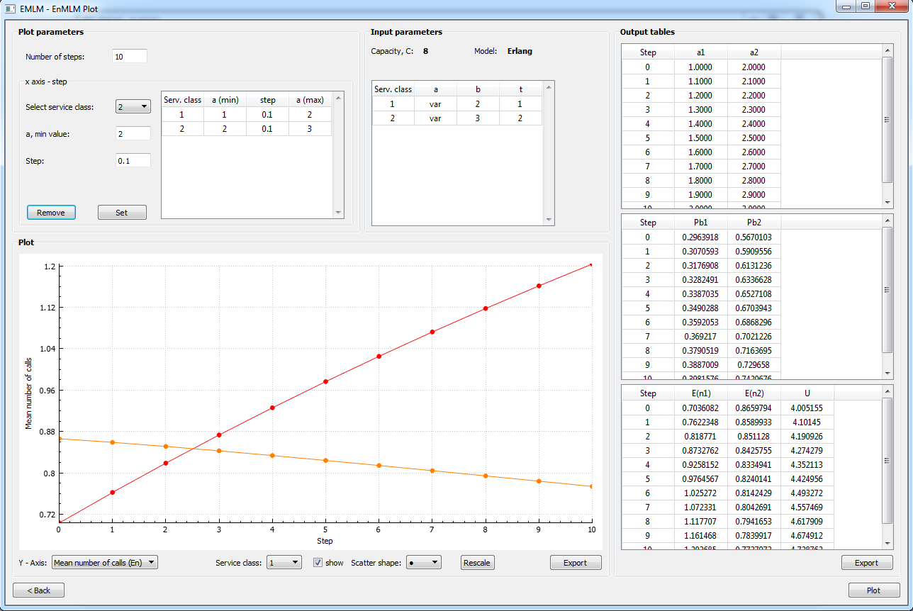

# EMLM-EnMLM

Calculate the blocking probabilities or the required capacity of a multi-service (several service-classes) link using the Erlang or Engset multirate loss model. Kaufman-Roberts and Stasiak-Glabowski recursive formulas have been implemented for fast calculations.

### Application Layouts

 

